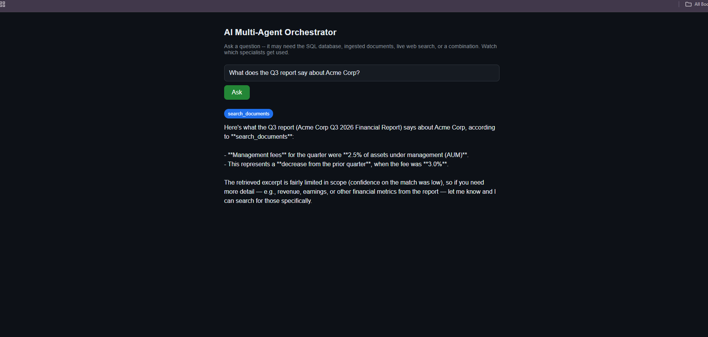
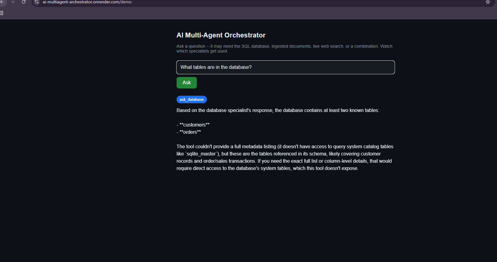
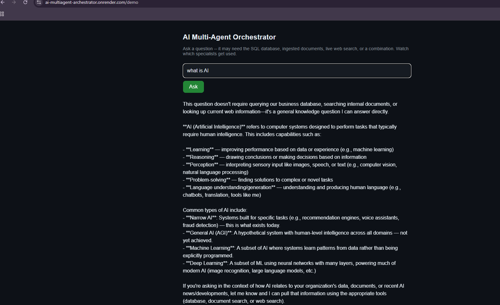

# AI Multi-Agent Orchestrator

A LangGraph-based supervisor that coordinates three independent AI specialists — a SQL database agent, a document RAG agent, and a live web research agent — routing each question to whichever specialist(s) it actually needs, and synthesizing their results into one answer.

**Live demo:** https://ai-multiagent-archestrator.onrender.com/demo
**MCP endpoint:** https://ai-multiagent-archestrator.onrender.com/mcp

This is Project 3 in a portfolio series. The two specialists it coordinates are themselves independently deployed, production projects:
- [`ai-sql-agent-mcp`](https://github.com/rajmyagentit-del/ai-sql-agent-mcp) — Project 1
- [`ai-document-mcp`](https://github.com/rajmyagentit-del/ai-document-mcp) — Project 2

---

## Why this project

Most "agent" demos show a single LLM calling a single tool. This project demonstrates something closer to production multi-agent systems: a supervisor that must *decide which of several independent, already-deployed services to call*, potentially several at once, and combine their results honestly — including saying when a specialist's answer is incomplete or low-confidence, rather than papering over gaps.

## Architecture

1. A user question comes in to the **LangGraph Supervisor** (Claude Sonnet 5).
2. The supervisor decides which specialist(s) the question needs, and calls one, several, or none:
   - `ask_database` -> a live MCP call to **ai-sql-agent-mcp** (Project 1, deployed independently on Render)
   - `search_documents` -> a live MCP call to **ai-document-mcp** (Project 2, deployed independently on Render)
   - `search_web` -> a live call to the **Tavily Search API**
3. Specialist results return to the supervisor, which synthesizes one final answer -- citing which specialist(s) it used, and flagging low-confidence or missing information honestly rather than guessing.

The supervisor and both MCP client wrappers run in *this* service. `ask_database` and `search_documents` are thin clients making real network calls to two other, independently deployed services -- not local functions pretending to be remote.

## Features

- **Multi-specialist fan-out**: a single question can trigger multiple specialists in parallel (e.g. "what do our documents say about X, and what's the latest news on X?" correctly calls both `search_documents` and `search_web` in one supervisor turn — verified live, see Proof section below).
- **Judgment, not blind routing**: the supervisor recognizes when a question needs *no* specialist at all and answers directly from general knowledge (verified live — see Proof section).
- **Triple exposure**: the same orchestration logic is reachable three ways — as an MCP tool (`orchestrate`), as a REST endpoint (`/demo/query`), and via a browser demo (`/demo`) — all sharing one code path so they can't drift out of sync.
- **Graceful degradation**: if a specialist errors or returns low-confidence results, the supervisor says so explicitly rather than fabricating certainty.

## Live demo -- real, unedited output

Three real queries run against the live public deployment:

**1. Document specialist, correctly scoped**

> "What does the Q3 report say about Acme Corp?"

Routed to `search_documents` only. Returned the real management-fee figures from the ingested report, and honestly flagged low retrieval confidence rather than overstating certainty.

**2. SQL specialist, with an honest limitation**

> "What tables are in the database?"

Routed to `ask_database`. Correctly identified the `customers` and `orders` tables, and explicitly explained what it could not determine (no system-catalog access) instead of guessing.

**3. No specialist needed**

> "what is AI"

Correctly recognized this needed no tool call at all, answered directly, and proactively offered to use a specialist if the question had actually been about the org's own data.

## Tech stack

| Layer | Technology |
|---|---|
| Orchestration | LangGraph (supervisor + tool-calling graph) |
| LLM | Claude Sonnet 5 (Anthropic API) |
| Specialist transport | MCP (Model Context Protocol) over streamable HTTP |
| Web research | Tavily Search API |
| Server | FastMCP 3 (MCP server + custom REST/HTML routes) |
| Testing | pytest, pytest-asyncio, unittest.mock |
| CI | GitHub Actions |
| Deployment | Docker on Render (free tier) |
